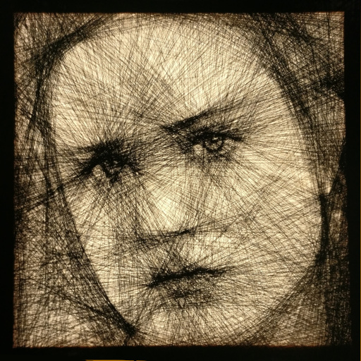
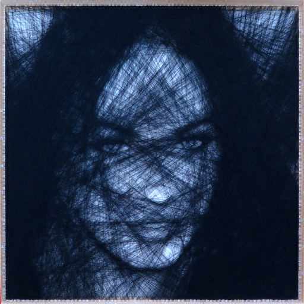

# Creating String Art

I started to experiment with string art during my vacation in summer 2017. The idea behind this technique is simple. You take an empty canvas, hammer in a lot of nails around the border and tie a long string to one of the nails. Then you weave the string from nail to nail, going across the canvas over and over again.

During this process, patterns will emerge. Areas where the string overlaps become darker, while the natural white color of the canvas dominates in areas where the string passes by less. That way, you can create beautiful patterns but also model more complex objects like faces.

When creating those images, I follow some self-defined rules:

* The whole picture is made from a single piece of string
* There are only nails on the border, none in the middle of the canvas
* I weave the string between the same two nails only once, so that the string never overlaps exactly

The human mind alone is not capable of dealing with this complexity. Therefore, I developed a script that helps me calculating the perfect path to weave the portrait. For those of you interested in the algorithm, take a look at my summary [Human and AI collaboration](./human_ai_collaboration.md#human-and-ai-collaboration).

On the left side below you see all the raw material I use to create string art. On the right you see a canvas already prepared with all the nails and mounted on my easel.

## Early Experiments

While the idea is quite simple in theory, I had no idea if it would really work out on an actual canvas. Initially, I created several prototypes on smaller canvases and different types of string. There were several things I realized during my experiments:

* Black string works much better than any other color because of the contrast.
* The thinner the string, the more details you can model. Sewing thread worked best for me so far.
* The size of the canvas and the amount of nails have a huge influence on the quality of the picture. I wouldn't recommend anything small than 60cm x 60cm and less than 150 nails on each side.

Here are some of my early prototypes that helped me to shape my technique.

On the left you can see Bob Odenkirk (as Saul from "Better Call Saul") and on the right it tried my luck with Emilia Clarke (as Daenerys Targaryen from "Game of Thrones"). Saul was my smallest attempt on a 20cm x 20cm canvas with 50 nails on each side. Daenerys was my first try on a 40cm x 40cm canvas with 60 nails on each side. You can see the difference in detail, but unfortunately Daenerys turned out darker than I expected and her hairline isn't clear enough. Based on those early results I decided that I had to increase the size of the canvas and especially the amount of nails on each side to get to the level of detail I was aiming for.

## Finished Portraits

So far I have finished three pieces of art that I am really satisfied with.

The first one is a portrait of Natalie Dormer, inspired by her performance on Game of Thrones as Margaery Tyrell. The canvas has a size of 70cm x 70cm with 150 nails on each side. I used at least 3.500 meters of sewing thread. The whole process took me about 30 hours from start to finish. Here is the final result which currently watches over my living room.

You can also take a look at the [Making-of Natalie Dormer String-Art](./making-of-natalie-dormer-string-art/README.md#natalie-dormer-string-art-portrait) to follow the creation process step by step and see a higher resolution photo.

The second one is a portrait of Evan Rachel Wood, inspired by her performance on Westworld as Dolores Abernathy. The canvas has a size of 60cm x 60cm with 200 nails on each side. I used at least 3.000 meters of sewing thread. It is my first portrait using a backlight to increase the depth of the image. The whole process took me about 40 hours from start to finish, including my research to develop the backlight technique.

You will find more details about the portrait and the backlight technique in the [Making-of Evan Rachel Wood String-Art](./making-of-evan-rachel-wood-string-art/README.md#evan-rachel-wood-string-art-portrait).

The third portrait stars Megan Fox. It has a canvas size of 70cm x 70cm with 220 hooks on each side. I used at least 3.000 meters of sewing thread. It is my first portrait using [a wooden frame](./making-of-wooden-frame/README.md#making-of-the-wooden-frame), which gives the portrait a more professional touch. The whole process took me about 40 hours from start to finish, including crafting the frame. I tried to give it a darker and more massive look this time, which requires the picture to be placed on a bright wall for maximum effect.

Of course there is also a [Making-of Megan Fox String-Art](./making-of-megan-fox-string-art/README.md#megan-fox-string-art-portrait) page that shows the creation process step by step and includes a higher resolution photo.

## Current Project

I am currently taking a short break to contemplate what I want to create next. I'll post updates here when I have decided how to continue.

# About the Artist

If you like my work, follow me on [Twitter](https://twitter.com/Dementophobia), so that you won't miss any new creations I publish. You can also drop me a message there, to get in contact with me. Yes, you've found the right profile - I'm more a tech guy in real life. Creating string art is just one of my hobbies.
