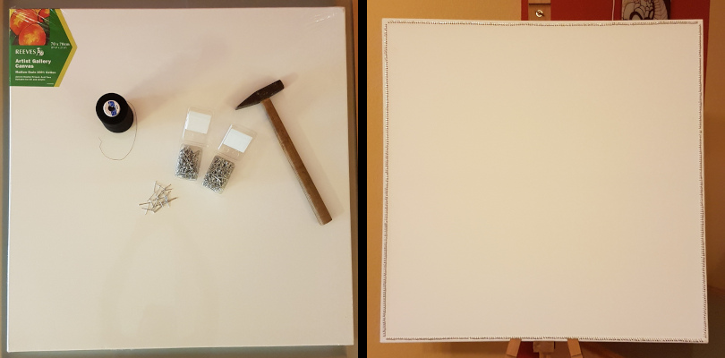
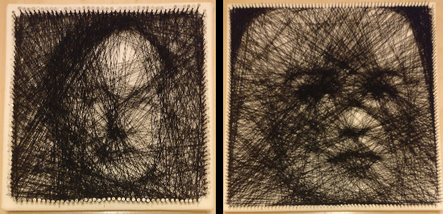
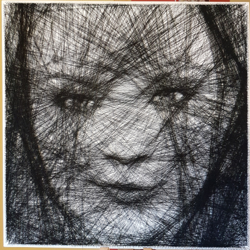
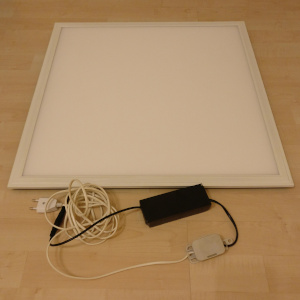
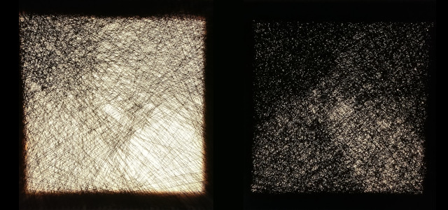
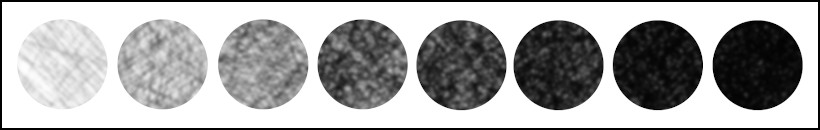

# Creating String Art

I started to experiment with string art during my vacation in summer 2017. The idea behind this technique is simple. You take an empty canvas, hammer in a lot of nails around the border and tie a long string to one of the nails. Then you weave the string from nail to nail, going across the canvas over and over again.

During this process, patterns will emerge. Areas where the string overlaps become darker, while the natural white color of the canvas dominates in areas where the string passes by less. That way, you can create beautiful patterns but also model more complex objects like faces.

When creating those images, I follow some self-defined rules:

* The whole picture is made from a single piece of string
* There are only nails on the border, none in the middle of the canvas
* I weave the string between the same two nails only once, so that the string never overlaps exactly

On the left side you see all the raw material I use to create string art. On the right you see a canvas already prepared with all the nails and mounted on my easel.

## Early Experiments

While the idea is quite simple in theory, I had no idea if it would really work out on an actual canvas. Initially, I created several prototypes on smaller canvases and different types of string. There were several things I realized during my experiments:

* Black string works much better than any other color because of the contrast.
* The thinner the string, the more details you can model. Sewing thread worked best for me so far.
* The size of the canvas and the amount of nails have a huge influence on the quality of the picture. I wouldn't recommend anything small than 60cmx60cm and less than 150 nails on each side.

Here are some of my early prototypes that helped me to shape my technique.

On the left you can see Bob Odenkirk (as Saul from "Better Call Saul") and on the right it tried my luck with Emilia Clarke (as Daenerys Targaryen from "Game of Thrones"). Saul was my smallest attempt on a 20cm x 20cm canvas with 50 nails on each side. Daenerys was my first try on a 40cm x 40cm canvas with 60 nails on each side. You can see the difference in detail, but unfortunately Daenerys turned out darker than I expected and her hairline isn't clear enough. Based on those early results I decided that I had to increase the size of the canvas and especially the amount of nails on each side to get to the level of detail I was aiming for.

## Finished Work

So far I have finished one piece of art that I am really satisfied with. It is an portrait of Natalie Dormer, inspired by her performance on Game of Thrones as Margaery Tyrell. The canvas has a size of 70cm x 70cm with 150 nails on each side. I used at least 3.500 meters of sewing thread. The whole process took me about 30 hours from start to finish. Here is the final result which currently watches over my living room.

You can also take a look at the [Making-of Natalie Dormer String-Art](./making-of-natalie-dormer-string-art/README.md#natalie-dormer-string-art-portrait) to follow the creation process step by step and see a higher resolution photo.

## Current Project

I started creating string art because I enjoy the process of experimentation. That's why I decided to try something different next - String Art with Backlight!

The canvases I am using are somewhat translucent, which allows me to to but a light source behind the image. The reason I want to try this is not because I want to create a fancy lamp, but I see the potential to improve the depth of the image. Once you reach a certain density of the string through overlapping, the respective area appears black. Adding more string doesn't really change it any more. With a light source behind the image though, more string is required the reach the same level of darkness. Therefore, at least in my theory, I have more shades of gray available to play with.

Although I prefer larger canvases, I will create a 60cm x 60cm image this time. The limiting factor was the availability of suitable light sources. I decided to get a flat ceiling lamp and rewire it, so that I can plug it into a normal wall socket. First I wanted to use my good old soldering iron, but wiser people convinced me to hand it over to a professional electrician. Safety first is a good rule of thumb when playing with electricity. Here is the result:

Although my next creating will be a little smaller than my first one, I will increase the amount of nails on each side to 200. This will allow me to work out finer details while also putting more string on the board to reach the desired darkness.

The only downside to this approach is that the image will be too dark without the backlight. Details will only start to appear when the light is turned on.

Before starting with the actual piece of art, I did some experiments with different amounts of string to check out the potential range of shading that will be possible. For the curious, here are the two work pieces I created, each containing four different shades.

Those are normal canvases with 30cm x 30cm, different amounts of string and the backlight installed behind them.

To see the effect even better, I've put samples from those eight levels of shading in order for you:

At least in theory this should enable me to create even more depth compared to string art images without a backlight. Let's see if it really works out in practice.

Stay tuned, updates will follow when I am finished with this one.

# About the Artist

If you like my work, follow me on [Twitter](https://twitter.com/Dementophobia), so that you won't miss any new creations I publish. You can also drop me a message there, to get in contact with me. Yes, you've found the right profile - I'm more a tech guy in real life. Creating string art is just one of my hobbies.