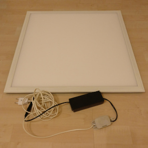
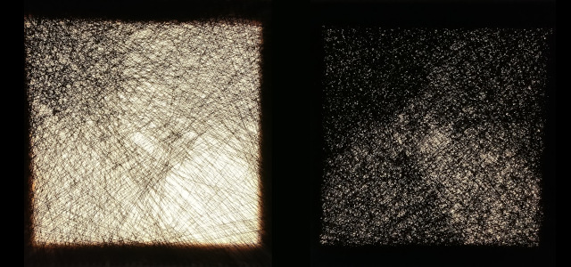
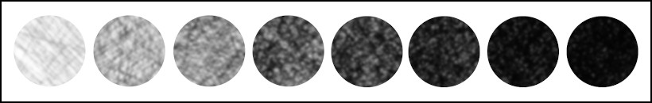
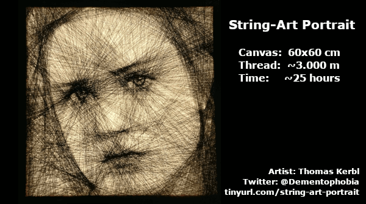
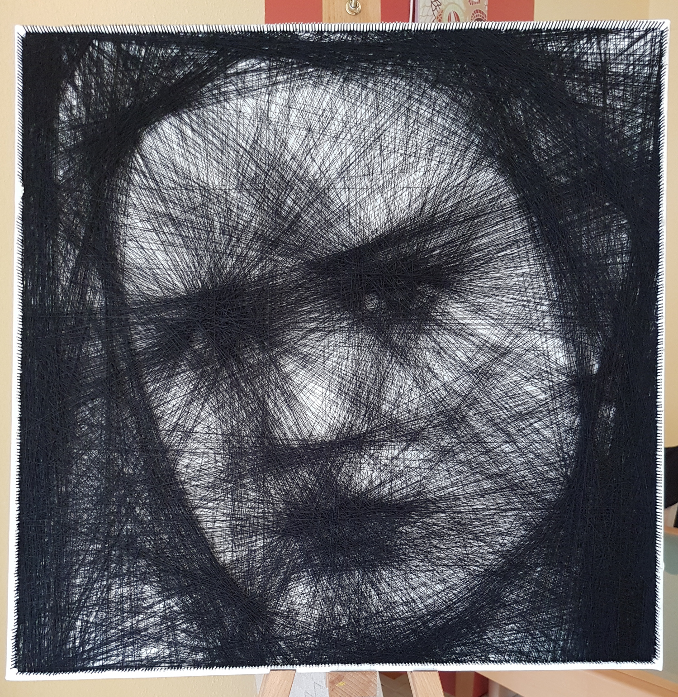

# Evan Rachel Wood String Art Portrait

This page is dedicated to my Evan Rachel Wood String Art portrait. If you want to know more about my creations, take a look at [Creating String Art](../README.md#creating-string-art).

## Specs of the Portrait

```
Canvas size:	60cm x 60cm
Nails per side:	200 nails
String used:	~3.000 meters of black sewing thread (one single string)
Backlight:	Modified Auraglow 40w LED Square Ceiling Panel (6000K)
```

## The Backlight Technique

I started creating string art because I enjoy the process of experimentation. That's why I decided to try something different with this portrait - String Art with Backlight!

The canvases I am using are somewhat translucent, which allows me to put a light source behind the image. The reason I tried this was not because I wanted to create a fancy lamp, but I saw the potential for improving the depth of the image. Once you reach a certain density of the string, the respective area appears black. Adding more string doesn't really change it any more. With a light source behind the image though, more string is required the reach the same level of darkness. Therefore, I have more shades of gray available to play with.

Although I prefer larger canvases, I created a 60cm x 60cm portrait this time. The limiting factor was the availability of suitable light sources. I decided to get a flat ceiling lamp and rewire it, so that I can plug it into a normal wall socket. First I wanted to use my good old soldering iron, but wiser people convinced me to hand it over to a professional electrician. Safety first is a good rule of thumb when playing with electricity. 

Here is the result:

<p align="center"></p>
I increased the amount of nails on each side to 200. This allowed me to work out finer details while also putting more string on the board to reach the desired darkness.

The only downside to this technique is that the image will be too dark without the backlight. Details will only start to appear when the light is turned on.

Before starting with the actual piece of art, I did some experiments with different amounts of string to check out the potential range of shading that will be possible. For the curious, here are the two work pieces I created, each containing four different shades.

<p align="center"></p>
Those are normal canvases (30cm x 30cm), different amounts of string and the backlight installed behind them.

To see the effect even better, I've put samples from those eight levels of shading in order for you:

<p align="center"></p>
This research enabled me to create even more depth compared to string art images without a backlight. 

## Animation from start to finish

The following animation was made from the photos I took during the creation process. The color tone varies a little, because the light environment was not constant, as I was using daylight for illumination.

In contrast to my other portraits, which work well under normal lighting conditions, this one is designed to be viewed with a strong backlight at night. It will appear much too dark during daylight, but will reveal all its hidden details when the backlight is turned on. Only the final picture has been shot with the backlight in place, the remaining pictures have all been taken with natural lighting.

The whole process, including the preparation of the canvas, took around 25 hours total, spread over several weeks. This excludes all the research done to develop the backlight technique as well as choosing, procuring and modifying the backlight. All in all the full effort has been closer to 40 hours of work, taking everything into account.

<p align="center"></p>
## High Resolution Photo of the Portrait

If you want to take a closer look, here is a high resolution photo of the final portrait, still on the easel. You can click on the image to zoom in further.



# About the Artist

If you like my work, follow me on [Twitter](https://twitter.com/Dementophobia), so that you won't miss any new creations I publish. You can also drop me a message there, to get in contact with me. Yes, you've found the right profile - I'm more a tech guy in real life. Creating string art is just one of my hobbies.