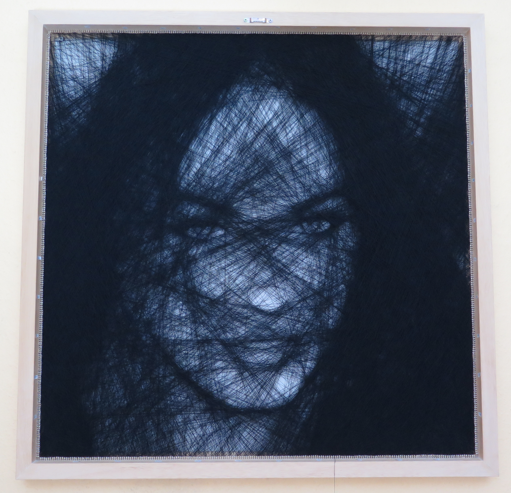

# Megan Fox String Art Portrait

This page is dedicated to my Megan Fox String Art portrait. If you want to know more about my creations, take a look at [Creating String Art](../README.md#creating-string-art).

## Specs of the Portrait

```
Canvas size:	70cm x 70cm
Frame material:	Ramin wood
Nails per side:	880 hooks
String used:	~3.000 meters of black sewing thread (one single string)
```

This is the first portrait I created with a custom made wooden frame. Everything there is to know about this special frame can found in the respective [making-of](../making-of-wooden-frame/README.md#making-of-the-wooden-frame).

## Animation from start to finish

The following animation was made from the photos I took during the creation process. The color tone varies a little, because the light environment was not constant.

The whole process, including the crafting of the frame, took around 40 hours total, spread over several weeks. Especially screwing in 880 hooks by hand took quite a lot of time.

<p align="center"></p>


## High Resolution Photo of the Portrait

If you want to take a closer look, here is a high resolution photo of the final portrait, still from the backside on the wall. I will upload the final version, once the portrait is in its designated place. You can click on the image to zoom in further.



# About the Artist

If you like my work, follow me on [Twitter](https://twitter.com/Dementophobia), so that you won't miss any new creations I publish. You can also drop me a message there, to get in contact with me. Yes, you've found the right profile - I'm more a tech guy in real life. Creating string art is just one of my hobbies.