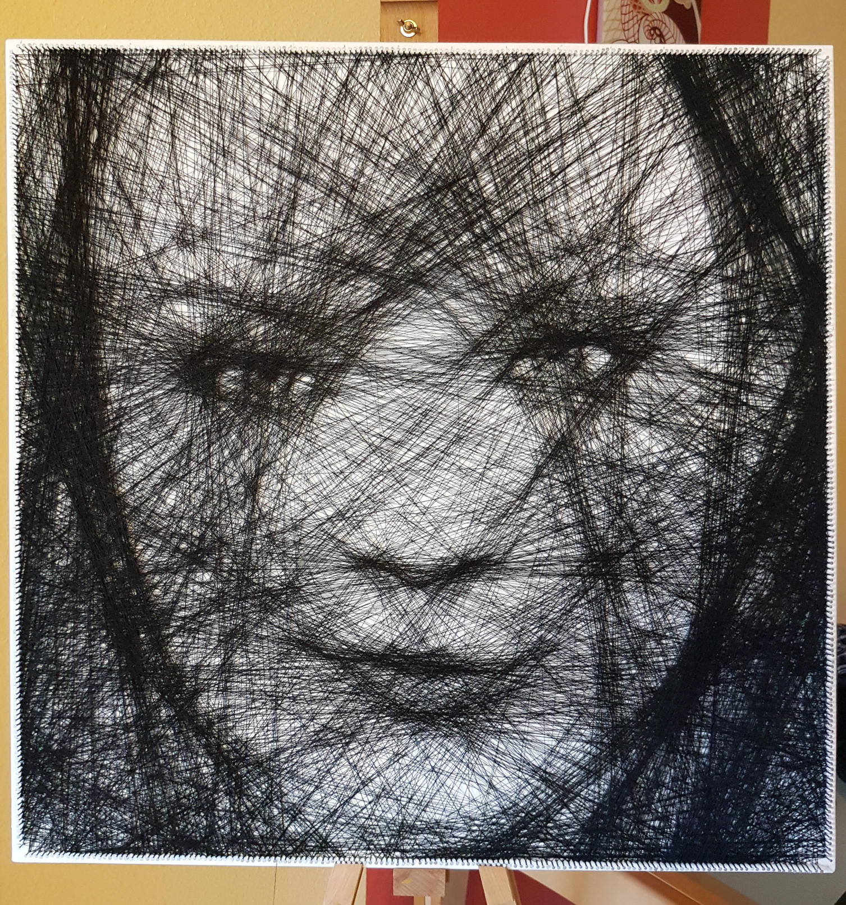

# Natalie Dormer String Art Portrait

This page is dedicated to my Natalie Dormer String Art portrait. If you want to know more about my creations, take a look at [Creating String Art](../README.md#creating-string-art).

## Specs of the Portrait

```
Canvas size:	70cm x 70cm
Nails per side:	150 nails
String used:	~3.500 meters of black sewing thread (one single string)
```

## Animation from start to finish

The following animation was made from the photos I took during the creation process. The color tone varies a little, because the light environment was not constant, as I was using daylight for illumination.

You can see me starting from a blank canvas, slowly working out the details of the portrait. Around the fourth or fifth photo you can start seeing basic shapes like eyes, nose and mouth appearing. At this stage, less than 500 meters of string have been used.

I kept refining the important details, without paying any attention to the background. The background was filled during the last phase, without significant impact on the face itself. This prioritization allowed me to focus on the key features of the image. The whole process, including the preparation of the canvas, took around 30 hours total, spread over several weeks.

<p align="center"></p>

## High Resolution Photo of the Portrait

If you want to take a closer look, here is a high resolution photo of the final portrait, still on the easel. You can click on the image to zoom in further.



# About the Artist

If you like my work, follow me on [Twitter](https://twitter.com/Dementophobia), so that you won't miss any new creations I publish. You can also drop me a message there, to get in contact with me. Yes, you've found the right profile - I'm more a tech guy in real life. Creating string art is just one of my hobbies.