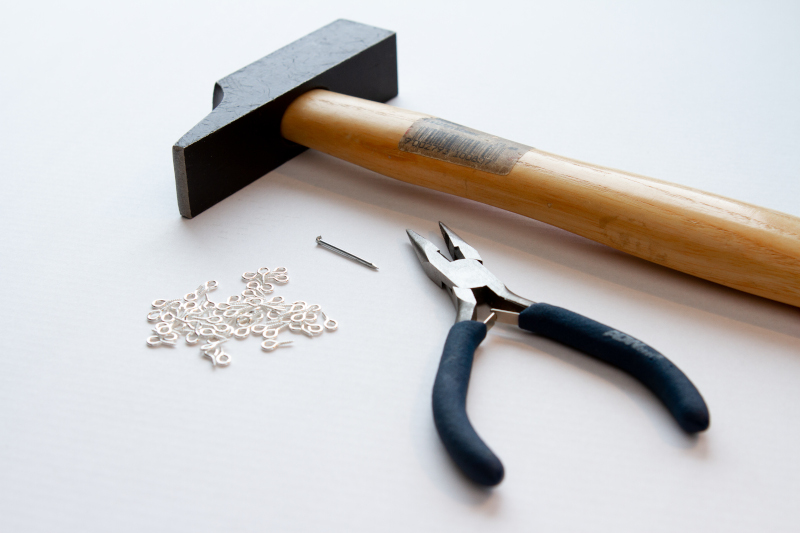
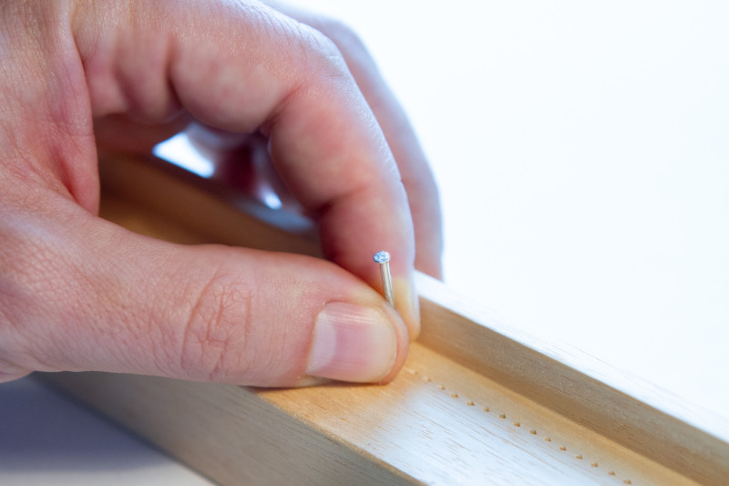
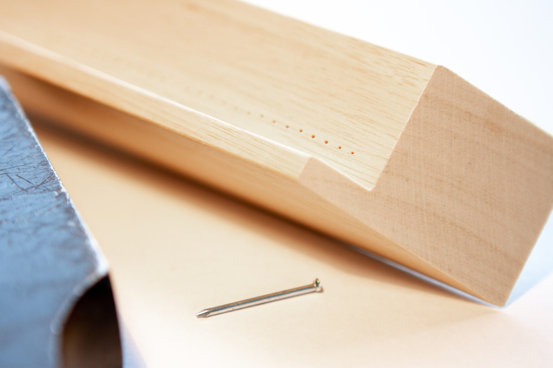
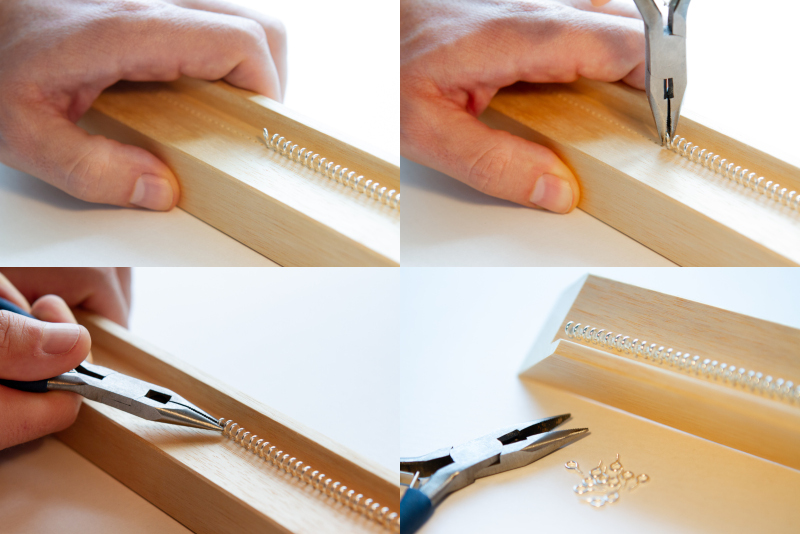
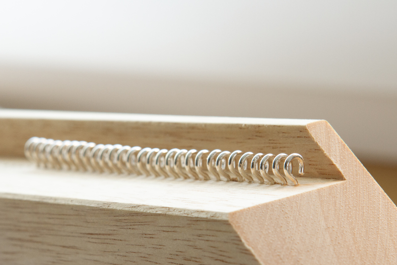
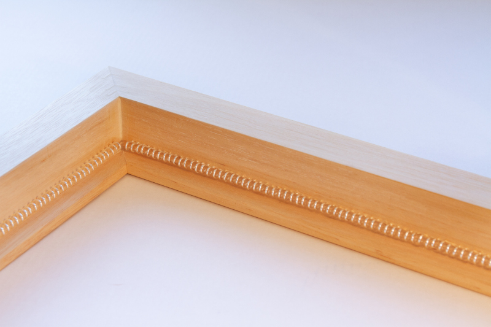
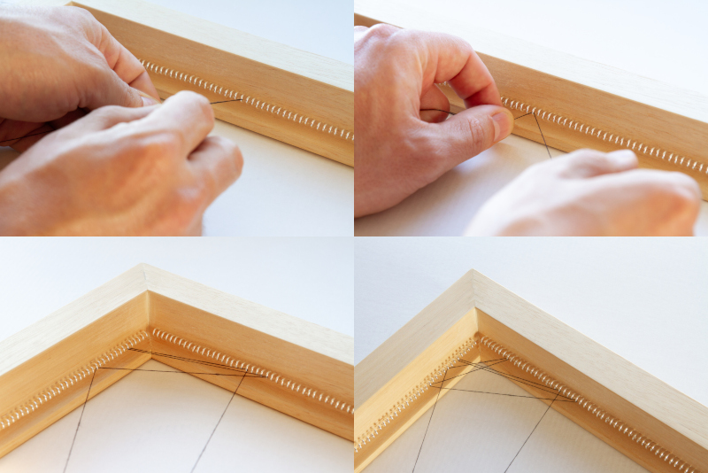

# Making of the Wooden Frame

After creating my first real string-art portraits like the [portrait of Natalie Dormer](../making-of-natalie-dormer-string-art/README.md#natalie-dormer-string-art-portrait) and the [portrait of Evan Rachel Wood](../making-of-evan-rachel-wood-string-art/README.md#evan-rachel-wood-string-art-portrait), I've decided to improve the quality of my picture frames. The previously used canvas with nails worked OK, but the frame showed a tendency to warp once the drag of the string got too strong. I also wanted to experiment with a transparent background, which is not possible with the canvas I was using before.

Therefore, I built my own wooden picture frame made from [Ramin](https://www.wood-database.com/ramin/) and small metal hooks as anchors for the string. A hammer, pliers and a nail were all the tools I needed. Cutting of the wood and the final assembly was done by [Rahmenwerkstadt Eder](https://www.bilderrahmen-werkstatt.at/).

If you look closely, you can see that the hooks are actually loops. To use them as hooks I had to bend them open a little after mounting them on the picture frame.

## Predrilling

Initially I planned screwing in the hooks without any preparation, but I soon realized that the screw thread was much too fragile for this approach. I had to predrill - but only a few millimeters deep - using a small nail in order to ensure a tight fit of the hooks. The result of this predrilling can be seen below.

## Mounting the Hooks

Predrilling 880 holes - 220 on each side of the picture frame - was already quite some work, but the real challenge was still ahead. Screwing in the hooks themselves in an evenly fashion would have been difficult enough, but with a spacing of only 3 mm between each hole there was hardly any room to maneuver. It honestly took quite a while until I had found the right technique, but in the end I was able to mount a hook and bend it open in under 2 minutes. Still, I spent many meditative hours with the pliers.

The result turned out better than I hoped for. What I hadn't realized when I was finished though, was the nuisance, that every singe hook was pointing in the wrong direction. I only  noticed this after I started with the actual portrait and couldn't pass the string across as intended after I used a hook the second time.

Long story short, I had to restart with the picture, but not before turning every single hook around 180°. Lessons learned, I guess. Below you can see the start of the original version with the hooks still pointed in the wrong direction.

There is one more nice feature of the frame that's worth pointing out. When the picture is finished, the frame will be mounted on the wall so that the wood jutting over will hide the hooks from the viewer, allowing him to focus on the actual picture instead of the mechanics.

## Final Assembly of the Picture Frame

Once all sides were done, I took my handiwork back to the Rahmenwerkstatt, where Mr. Eder and his crew glued together the individual sides and finished the picture frame. After only two days, I could already pick it up again and start using the final result.

With the frame finally completed, all there is left to do is crafting the next portrait. I will publish the results of my first portrait using the wooden frame when it is done. December 2019 sounds like a realistic deadline for this project, so stay tuned!

# Credits and Shout-outs

Thanks to [Magdalena Jünger](https://www.instagram.com/lena1379/) for shooting and preparing all the photos of this making-of. Check out her linked Instagram profile to see more of her amazing work.

I also want to thank [the team of Rahmenwerkstatt Eder](https://www.bilderrahmen-werkstatt.at/) for their consulting, the final assembly of the frame and several interesting philosophical talks in between. If you are in need for high quality and even custom made picture frames, look no further! I can highly recommend them.

# About the Artist

If you like my work, follow me on [Twitter](https://twitter.com/Dementophobia), so that you won't miss any new creations I publish. You can also drop me a message there, to get in contact with me. Yes, you've found the right profile - I'm more a tech guy in real life. Creating string art is just one of my hobbies.
